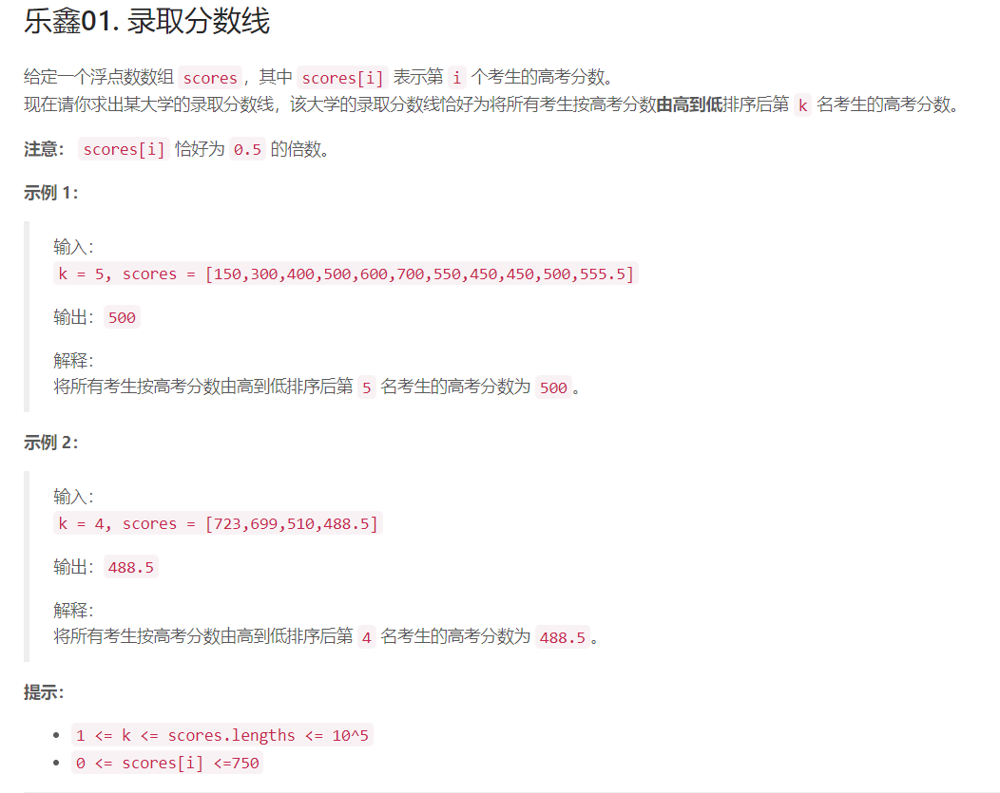
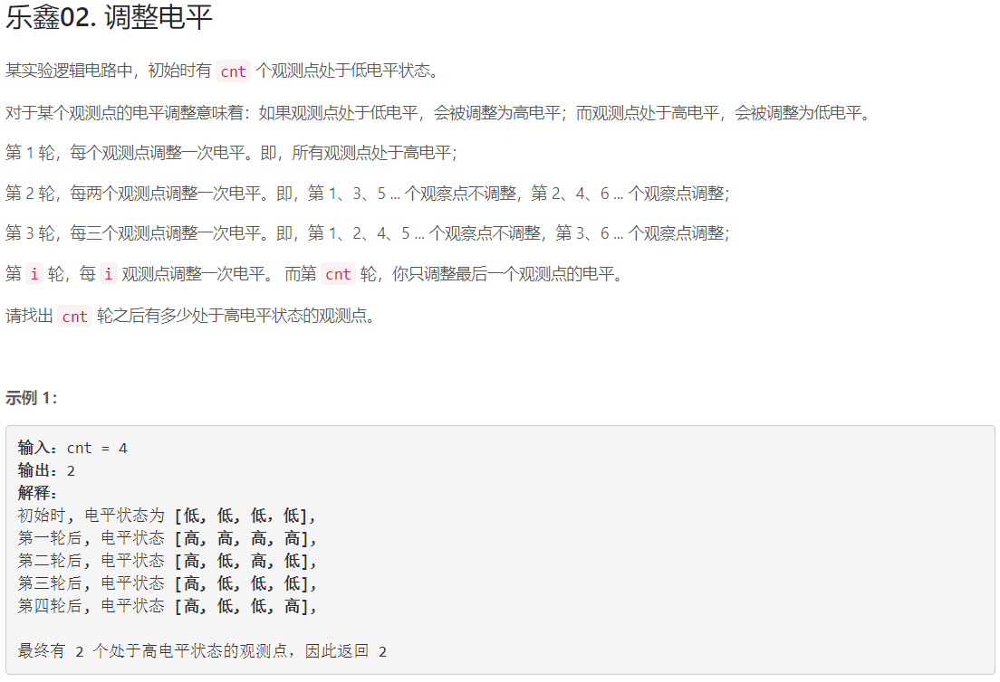
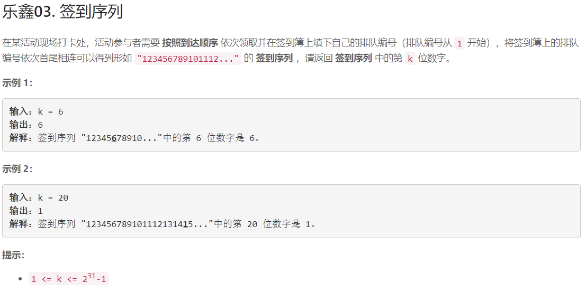
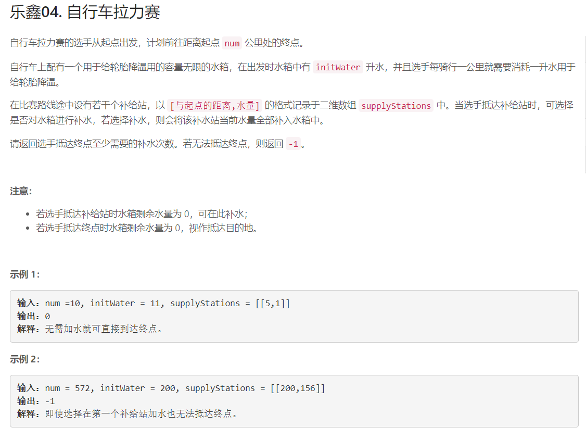

## 乐鑫科技专场竞赛

### 乐鑫01. 录取分数线

#### 题干



#### 思路

1. 排序
2. 定位

#### 解题

```c++
class Solution {
public:
double getAdmissionLine(int k, vector<double>& scores) {
sort(scores.rbegin(), scores.rend());
return scores[k-1];
}
};
```

### 乐鑫02. 调整电平

#### 题干



#### 思路

对于某一个点 `i`，在其约数的轮次会被调整一次。例如`12`在 `1, 2, 3, 4, 6, 12`轮各被调整一次，`3`在` 1, 3`
轮各被调整一次。所以最终某点若处于高电平，说明该点被调整了奇数次，也即只有奇数个约数。根据数学知识，只有完全平方数才有奇数个约数，所以本题只需要判断`[1, cnt]`中有多少个完全平方数就行啦！

#### 算法细节

根据分析，判断`[1,cnt]`中有多少完全平方数即可，也即，只需要判断最大的小于等于`cnt`的完全平方数是多少。

#### 解题

```c++
class Solution {
public:
int adjustLevel(int cnt) {
return sqrt(cnt);
}
};
```

##### 复杂度分析：

- 时间复杂度：$O(\sqrt(n))$

### 乐鑫03. 签到序列

#### 题干



#### 思路

1. 判断第 k 位数字对应的数是几位数
2. 假设是 n 位数，我们继续判断第 k 位数字对应的数是第几个 nn 位数
3. 假设是 第 m 个 n 位数，我们判断第 k 位数字对应的数是该数的第几位

#### 算法细节

对于步骤 1，我们观察不同位数的长度规律：

共有 9 个 1 位数，90个 2 位数，900 个 3 位数......故 n 位数共有 $ 10^{(n - 1)} \times 9$ 个，由于 k 不超过 $2^{31} - 1$，所以最多为 10 位数，我们最多遍历到 n =
10 即可得到解。特别地，为了后续处理方便，我们每次遍历 n 时，如果当前 k 大于该位数的全部长度，则用 k 减去这个长度，以保证最终得到的 k 在 $[0, 10^{n-1} \times 9]$ 范围内。

对于步骤 2 和 3，我们此时已经知道了是 n 位数，故每个数长度为 n，又知道当前长度为 k，只需要通过求$\lceil k \div n \rceil$，就能知道当前是第几个数，通过余数就知道是第几位啦！

#### 解题

```c++
class Solution {
using ll = long long;
public:
ll longPow(ll a, ll b) {
// 快速幂，求 a ^ b
ll ret = 1;
while (b) {
if (b & 1) ret = (ret * a);
a = (a * a);
b >>= 1;
}
return ret;
}

int getKthNum(int k) {
int n;
for (n = 1; n < 9; n++) {
// 当前 n 位数的全部长度
ll curlen = longPow(10, n - 1) * 9 * n;
if (curlen >= k) break;
k -= curlen;
}

// 已知 n 位数和 k，求第几个数的第几位
ll q = (k + n - 1) / n, b = (k + n - 1) % n;
// 第 q 个数
ll num = longPow(10, n - 1) + q - 1;

string s = to_string(num);
return s[b] - '0';
}
};
```

#### 复杂度分析

- 时间复杂度：$O(\lg{n})$

### 乐鑫04. 自行车拉力赛

#### 题干



#### 思路

#### 算法细节

#### 解题

```c++

```

#### 复杂度分析

- 时间复杂度：$O()$