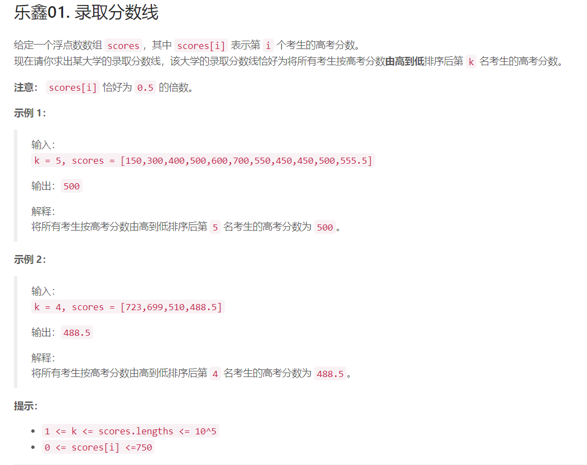
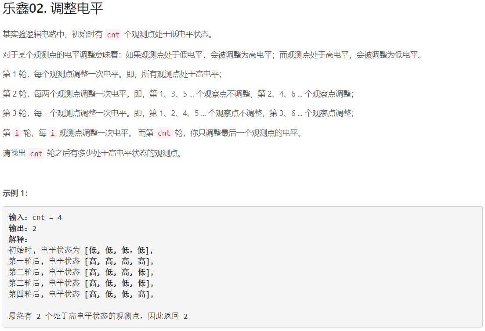

## 乐鑫科技专场竞赛

### 乐鑫01. 录取分数线

#### 题干



#### 思路

1. 排序
2. 定位

#### 解题

```c++
class Solution {
public:
  double getAdmissionLine(int k, vector<double>& scores) {
    sort(scores.rbegin(), scores.rend());
    return scores[k-1];
  }
};
```

### 乐鑫02. 调整电平

#### 题干



#### 思路


对于某一个点 `i`，在其约数的轮次会被调整一次。例如`12`在 `1, 2, 3, 4, 6, 12`轮各被调整一次，`3`在` 1, 3`轮各被调整一次。

所以最终某点若处于高电平，说明该点被调整了奇数次，也即只有奇数个约数。根据数学知识，\
只有完全平方数才有奇数个约数，所以本题只需要判断`[1, cnt]`中有多少个完全平方数就行啦！

#### 算法细节：
根据分析，判断`[1,cnt]`中有多少完全平方数即可，也即，只需要判断最大的小于等于`cnt`的完全平方数是多少。

#### 解题

```c++
class Solution {
public:
  int adjustLevel(int cnt) {
    return sqrt(cnt);
  }
};
```

#### 复杂度分析：
时间复杂度：`O(sqrt(n))`
